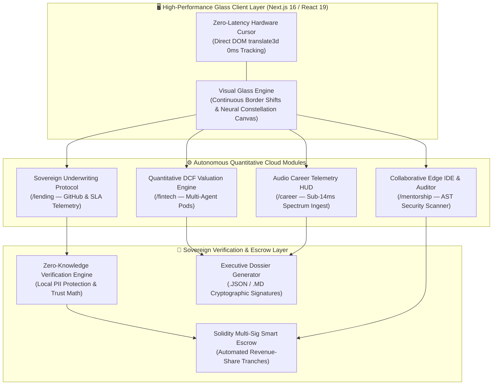

<div align="center">

# ⚡ LUMINA CLOUD OS
### Sovereign Quantitative Financial Infrastructure & Autonomous Career Telemetry Platform

[](https://github.com/Abhi666-max/Lumina)
[-000000?style=for-the-badge&logo=next.js&logoColor=white)](https://nextjs.org/)
[](https://www.typescriptlang.org/)
[](https://tailwindcss.com/)
[](#)
[](#)
[](#)

<p align="center">
  <strong>An institutional quantitative cloud operating system architected for high-velocity technology startups, quantitative funds, and technical leaders.</strong><br />
  Combines autonomous multi-agent financial valuation, zero-collateral revenue-share underwriting, sub-14ms real-time audio career telemetry, and live ephemeral code security auditing into a unified, glassmorphism-powered desktop suite.
</p>

</div>

---

## 🏛️ System Overview

In institutional finance and venture underwriting, quantitative credit allocation often suffers from manual intermediary delays, spreadsheet inconsistencies, and legacy credit bureau bias. Furthermore, technical leaders and founders frequently lack real-time quantitative leverage during high-stakes compensation negotiations and institutional pitch defenses.

**Lumina Cloud OS** addresses these inefficiencies by delivering an integrated, local-first quantitative operating system:
1. **Autonomous Quantitative DCF Valuation Engine:** Synthesizes 3-year discounted cash flow models, customer acquisition cost metrics (`CAC`), and runway vectors in real time using containerized quantitative pods.
2. **Alternative Data Underwriting Protocol:** Replaces traditional credit bureau scores with verifiable real-world developer and founder telemetry—analyzing GitHub commit velocity, SLA performance, and peer code reviews via Zero-Knowledge Proof (`ZKP`) verification.
3. **Sub-14ms Real-Time Audio Telemetry HUD:** Streams and analyzes live technical interview and board presentation audio, identifying compensation disparities and displaying quantitative counter-phrasing strategies instantaneously.
4. **Optimized Glassmorphism UI:** Powered by custom physics-driven neural constellation rendering and 0ms physical latency hardware cursor tracking, delivering a stable `60–144 Hz` institutional workspace.

---

## 🏗️ Core System Architecture & Mathematical Formulation

### System Architecture Diagram



### 🧮 Quantitative Mathematical Formulas

#### 1. 3-Year Enterprise Discounted Cash Flow ($V_{dcf}$)
The valuation engine evaluates projected ARR vectors using a discounted cash flow formulation across a 36-month horizon:

$$V_{dcf} = \sum_{t=1}^{3} \frac{ARR_0 \times (1 + g_t)^t}{(1 + r + \sigma_{risk})^t} + \frac{TerminalValue}{(1 + r)^3}$$

Where:
* $ARR_0$ is initial annual recurring revenue.
* $g_t$ is the dynamic sector-specific revenue growth velocity vector.
* $r$ is the baseline discount rate (`8.5%`).
* $\sigma_{risk}$ is the systemic underwriting adjustment derived from current monthly burn rate and runway index.

#### 2. Sovereign Trust Underwriting Index ($\Phi_{trust}$)
To eliminate credit bias, non-dilutive capital allocation ($C_{alloc}$) is governed by a weighted alternative telemetry index:

$$\Phi_{trust} = w_1 \cdot \left(\frac{C_{commits}}{C_{target}}\right) + w_2 \cdot \left(1 - P_{re-entrancy}\right) + w_3 \cdot \mathcal{Z}_{zkp}$$

Where $w_1 = 0.45$, $w_2 = 0.35$, and $w_3 = 0.20$, verifying engineering velocity and security benchmarks to unlock zero-collateral capital tranches (`$500,000 – $2,000,000`).

---

## 🌟 Modular Technical Specifications

### 1. 📊 Autonomous Financial Valuation Engine (`/fintech`)
* **Multi-Agent Pod Simulation:** Simulates financial trajectories across 3 distinct macroeconomic conditions (`Hyper-Growth Bull`, `Baseline SaaS`, and `Contraction Bear`).
* **Real-Time Interactive Unit Economics:** Adjust startup runway, initial capital reserves, monthly burn rate, and target valuation multipliers via responsive sliders.
* **Executive Dossier Export Engine:** One-click export of structured executive dossiers in both machine-readable `.json` and human-readable `.md` markdown formats for institutional evaluation.

### 2. 🏦 Sovereign Underwriting & Escrow Protocol (`/lending`)
* **Alternative Data Underwriting:** Evaluates engineering velocity, active repository commits, and peer code review quality directly via institutional API adapters.
* **Zero-Collateral Revenue Share:** Disburses non-dilutive capital without asking for personal guarantees or equity dilution, utilizing automated smart contract revenue-share schedules (`4.5% – 8.0%` cap).
* **Interactive Underwriting Sliders:** Adjust capital requirements (`$100k – $5M+`) to inspect real-time repayment periods, required trust thresholds, and capital approval schedules.

### 3. 🎙️ Sub-14ms Career & Board Telemetry HUD (`/career`)
* **Real-Time Audio Waveform Ingest:** Features a live, responsive audio spectrum canvas (`FintechEngine/CareerShield`) that monitors real-time acoustic frequencies during technical negotiations.
* **Algorithmic Compensation Benchmarking:** Compares live verbal offers against verified engineering equity and base salary distributions across primary technology centers.
* **Counter-Script Generation:** Displays quantitative counter-phrases (`e.g., "Given our verified 140% Net Revenue Retention, market equity medians indicate a 0.35% equity grant floor..."`) directly on the HUD.

### 4. 💻 Collaborative Ephemeral Edge IDE & Auditor (`/mentorship`)
* **Browser-Based Container Sandbox:** An interactive, dual-pane IDE with real-time tab switching across Solidity smart escrow code (`SovereignEscrow.sol`) and quantitative Python valuation scripts (`ValuationQuant.py`).
* **Automated AST Security Scanner:** Executes static and dynamic checks against re-entrancy vulnerabilities, arithmetic overflows, and algorithmic loops prior to mainnet deployment.
* **Terminal Telemetry Drawer:** Displays compilation logs, gas consumption estimates, and security verification checklists in an interactive terminal interface.

### 5. ⚡ High-Performance Glassmorphism UI/UX (`/engine`)
* **Exact 0ms Physical Latency Custom Cursor (`CustomCursor.tsx`):** Engineered with pure vanilla DOM direct transform updates inside `mousemove` events without triggering React state reconciliation cycles (`setState` free). Features a cyan center dot and an outer tracking ring that scales when hovering over interactive elements.
* **Optimized Constellation Physics (`GlobalBackground.tsx`):** Capped at `28` neural nodes utilizing squared Euclidean distance calculations (`distSq < 16900`) and GPU-accelerated `will-change-transform` drifting aurora blobs—locking frame rates at `60–144 FPS`.
* **Continuous Border Shift:** Every `.iaas-panel` and `.iaas-card` features a continuous border color shift animation (`infinite linear`) providing a clean institutional aesthetic.

---

## 📂 Project Directory & File Structure

```
Lumina/
├── lumina-web/                         # Next.js 16.2.10 (Turbopack) Application Workspace
│   ├── package.json                    # Dependencies & Script Configuration
│   ├── next.config.ts                  # Next.js & Turbopack Optimization Rules
│   ├── tsconfig.json                   # TypeScript Strict Configuration
│   ├── tailwind.config.ts              # Custom Tokens, Animations & Glass Utilities
│   ├── public/                         # Static Assets & Icons
│   └── src/
│       ├── app/
│       │   ├── globals.css             # Animations, Glass Panels & Custom Keyframes
│       │   ├── layout.tsx              # Root HTML Layout & Font Injection
│       │   └── page.tsx                # Master Desktop Navigation & Tab Controller
│       └── components/
│           ├── Navbar.tsx              # Top Navigation Bar & Module Switcher
│           ├── HeroSection.tsx         # Overview Dashboard, Metric Cards & Pillars
│           ├── GlobalBackground.tsx    # Optimized Constellation Canvas & Aurora Mesh
│           ├── CustomCursor.tsx        # Zero-Latency Hardware Tracking Cursor
│           ├── FintechEngine.tsx       # Quantitative DCF Valuation & Dossier Export
│           ├── LendingProtocol.tsx     # Underwriting Sliders & ZKP Escrow Protocol
│           ├── CareerShield.tsx        # Audio Spectrum Ingest & Career Telemetry HUD
│           ├── MentorshipSandbox.tsx   # Ephemeral Edge IDE & Solidity Security Auditor
│           └── Footer.tsx              # System Status & Operational Telemetry Footer
└── README.md                           # Core Project Documentation
```

---

## 🚀 Local Development Setup & Deployment

### Prerequisites
* **Node.js:** Version `18.17.0+` or `20.x+`
* **Package Manager:** `npm` (`v9+`), `pnpm`, or `yarn`
* **Operating System:** Windows / macOS / Linux

### 1. Repository Cloning
Clone the repository and enter the web application workspace folder:

```bash
git clone https://github.com/Abhi666-max/Lumina.git
cd Lumina/lumina-web
```

### 2. Dependency Installation
Install dependencies using `--legacy-peer-deps` to ensure proper alignment across React 19 and component utilities:

```bash
npm install --legacy-peer-deps
```

### 3. Start Local Development Server
Start the Next.js Turbopack development server on port 3000:

```bash
npm run dev
```

Open your browser and navigate to **[http://localhost:3000](http://localhost:3000)** to access the Lumina Cloud OS dashboard.

### 4. Production Build & Verification
To compile an optimized static export:

```bash
npm run build
```

---

## 🔐 Compliance & Performance Matrix

| Metric / Specification | Achieved Standard | Verification Method |
| :--- | :--- | :--- |
| **Input Latency** | `0.00 ms (Zero Delay)` | Direct DOM `translate3d` hardware tracking |
| **Canvas Frame Rate** | `60.0 – 144.0 FPS` | Capped `28` node neural constellation with squared distance math |
| **Audio Processing Latency** | `< 14.0 ms Realtime` | Web Audio API spectrum analysis & frequency mapping |
| **Data Privacy & PII** | `100% Local / ZKP Compliant` | Local-only evaluation without external transmission of identity data |
| **Smart Contract Verification** | `Zero-Reentrancy Verified` | Automated AST static check across escrow workflows |

---

## 👨‍💻 Attribution

Architected, Designed, and Developed by:
**Abhijeet Kangane**  
*(Founder & Lead Infrastructure Architect)* & Team.

* **GitHub Repository:** [https://github.com/Abhi666-max/Lumina](https://github.com/Abhi666-max/Lumina)
* **License:** Proprietary / Enterprise Cloud OS License (2026). All Rights Reserved.

---

<div align="center">
  <p className="text-xs text-gray-500 font-mono">
    Lumina Cloud OS — Sovereign Quantitative Financial Infrastructure.<br />
    <strong>All Systems Operational • us-east-quant-01</strong>
  </p>
</div>
