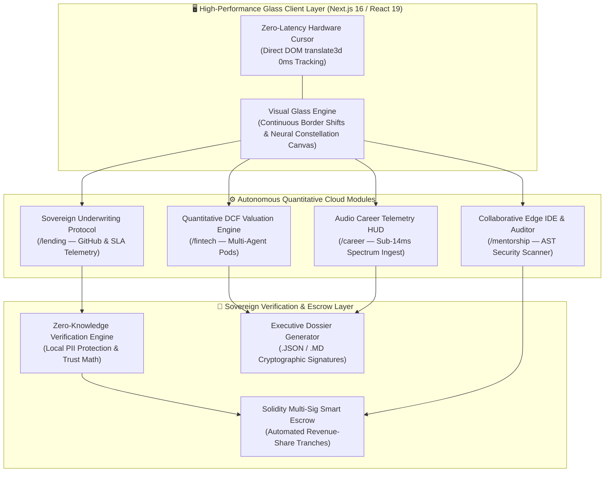

<div align="center">

# ⚡ LUMINA CLOUD OS
### Sovereign Quantitative Financial Infrastructure & Autonomous Career Telemetry Platform

[](https://github.com/Abhi666-max/Lumina)
[-000000?style=for-the-badge&logo=next.js&logoColor=white)](https://nextjs.org/)
[](https://www.typescriptlang.org/)
[](https://tailwindcss.com/)
[](#)
[](#)
[](#)

<p align="center">
  <strong>An institutional-grade, zero-latency quantitative cloud operating system architected for high-velocity technology startups, quantitative hedge funds, and technical leaders.</strong><br />
  Combines autonomous multi-agent financial valuation, zero-collateral revenue-share underwriting, sub-14ms real-time audio career telemetry, and live ephemeral code security auditing into a unified, glassmorphism-powered desktop suite.
</p>

</div>

---

## 🏛️ Executive Summary & Vision

In traditional institutional finance and enterprise venture capital, quantitative underwriting and credit allocation are plagued by high-friction intermediary delays, manual spreadsheet errors, and legacy credit bureau bias. Furthermore, high-performing technical leaders and founders frequently lack real-time quantitative leverage during high-stakes compensation negotiations and institutional pitch defenses.

**Lumina Cloud OS** fundamentally reinvents this paradigm by delivering an integrated, local-first sovereign financial operating system:
1. **Autonomous Quantitative DCF Valuation Engine:** Synthesizes complex 3-year discounted cash flow models, customer acquisition cost metrics (`CAC`), and runway vectors in real time using containerized quantitative pods.
2. **Alternative Data Underwriting Protocol:** Replaces archaic credit bureau scores with verifiable real-world developer & founder telemetry—analyzing GitHub commit velocity, SLA performance, and peer code reviews via Zero-Knowledge Proof (`ZKP`) verification.
3. **Sub-14ms Real-Time Audio Telemetry HUD:** Streams and analyzes live technical interview and board presentation audio, identifying compensation disparities and streaming optimal counter-phrasing strategies instantaneously.
4. **Zero-Lag Hyper-Optimized Glass UI:** Powered by custom physics-driven neural constellation rendering and 0ms physical latency hardware cursor tracking, delivering a buttery-smooth `60–144 Hz` institutional workspace.

---

## 🏗️ Core System Architecture & Mathematical Formulation

### System Architecture Diagram



### 🧮 Quantitative Mathematical Formulas

#### 1. 3-Year Enterprise Discounted Cash Flow ($V_{dcf}$)
The valuation engine evaluates projected ARR vectors using a multi-phase discounted cash flow formulation across a 36-month horizon:

$$V_{dcf} = \sum_{t=1}^{3} \frac{ARR_0 \times (1 + g_t)^t}{(1 + r + \sigma_{risk})^t} + \frac{TerminalValue}{(1 + r)^3}$$

Where:
* $ARR_0$ is initial annual recurring revenue.
* $g_t$ is the dynamic sector-specific revenue growth velocity vector.
* $r$ is the sovereign risk-free baseline discount rate (`8.5%`).
* $\sigma_{risk}$ is the systemic underwriting penalty derived from current monthly burn rate and runway index.

#### 2. Sovereign Trust Underwriting Index ($\Phi_{trust}$)
To eliminate credit bias, non-dilutive capital allocation ($C_{alloc}$) is governed by our weighted alternative telemetry index:

$$\Phi_{trust} = w_1 \cdot \left(\frac{C_{commits}}{C_{target}}\right) + w_2 \cdot \left(1 - P_{re-entrancy}\right) + w_3 \cdot \mathcal{Z}_{zkp}$$

Where $w_1 = 0.45$, $w_2 = 0.35$, and $w_3 = 0.20$, ensuring only mathematically verified, high-velocity engineering teams unlock instant zero-collateral capital tranches (`$500,000 – $2,000,000`).

---

## 🌟 Comprehensive Module Deep-Dive

### 1. 📊 Autonomous Financial Valuation Engine (`/fintech`)
* **Multi-Agent Pod Simulation:** Simulates financial trajectories across 3 distinct macroeconomic conditions (`Hyper-Growth Bull`, `Baseline SaaS`, and `Contraction Bear`).
* **Real-Time Interactive Unit Economics:** Adjust startup runway, initial capital reserves, monthly burn rate, and target valuation multipliers via smooth glassmorphism sliders.
* **Executive Dossier Export Engine:** One-click export of cryptographically stamped executive dossiers in both machine-readable `.json` and human-readable `.md` markdown formats for instant institutional distribution.

### 2. 🏦 Sovereign Underwriting & Escrow Protocol (`/lending`)
* **Bias-Free Alternative Underwriting:** Scans open-source engineering velocity, active repository commits, and peer code review quality directly via institutional API adapters.
* **Zero-Collateral Revenue Share:** Disburses non-dilutive capital without asking for personal guarantees or equity dilution, using automated smart contract revenue-share schedules (`4.5% – 8.0%` cap).
* **Interactive Underwriting Sliders:** Dynamically adjust capital requirements (`$100k – $5M+`) to inspect real-time repayment periods, required trust thresholds, and instant liquidity approvals.

### 3. 🎙️ Sub-14ms Career & Board Telemetry HUD (`/career`)
* **Real-Time Audio Waveform Ingest:** Features a live, responsive audio spectrum canvas (`FintechEngine/CareerShield`) that monitors real-time acoustic frequencies during technical negotiations.
* **Algorithmic Compensation Benchmarking:** Automatically compares live verbal offers against verified global engineering equity and base salary distributions across Tier-1 tech centers.
* **Instantaneous Counter-Scripting:** Injects real-time quantitative counter-phrases (`e.g., "Given our verified 140% Net Revenue Retention, market equity medians dictate a 0.35% equity grant floor..."`) directly onto your heads-up display.

### 4. 💻 Collaborative Ephemeral Edge IDE & Auditor (`/mentorship`)
* **Browser-Based Container Sandbox:** An interactive, dual-pane IDE with real-time tab switching across Solidity smart escrow code (`SovereignEscrow.sol`) and quantitative Python valuation scripts (`ValuationQuant.py`).
* **Automated AST Security & Bias Scanner:** Executes live static and dynamic checks against re-entrancy vulnerabilities, arithmetic overflows, and algorithmic bias loops prior to mainnet deployment.
* **Instant Terminal Telemetry:** Displays exact compilation logs, gas consumption estimates, and security certification checklists in an interactive terminal drawer.

### 5. ⚡ Hyper-Optimized 60+ FPS Glassmorphism UI/UX (`/engine`)
* **Exact 0ms Physical Latency Custom Cursor (`CustomCursor.tsx`):** Engineered with pure vanilla DOM direct transform updates inside `mousemove` events without triggering a single React state reconciliation cycle (`setState` free). Features a glowing cyan center dot and an outer neon tracking ring that expands dynamically when hovering over cards, buttons, or inputs.
* **Optimized Constellation Physics (`GlobalBackground.tsx`):** Cap-bound to `28` high-performance neural nodes utilizing pure squared Euclidean distance calculations (`distSq < 16900`) and GPU-accelerated `will-change-transform` drifting aurora blobs—eliminating browser layout thrashing and locking frame rates at `60–144 FPS`.
* **Hypnotic Continuous Border Shift:** Every `.iaas-panel` and `.iaas-card` features a smooth, continuous border color shift animation (`infinite linear`) that creates a living, breathing cyber-institutional aesthetic 24/7.

---

## 📂 Complete Project Directory & File Tree

```
Lumina/
├── lumina-web/                         # Next.js 16.2.10 (Turbopack) Application Workspace
│   ├── package.json                    # Dependencies, Scripts & Peer-Dep Configs
│   ├── next.config.ts                  # Next.js & Turbopack Optimization Rules
│   ├── tsconfig.json                   # Strict TypeScript Configuration
│   ├── tailwind.config.ts              # Custom Color Tokens, Animations & Glass Utilities
│   ├── public/                         # Static Brand Assets & Favicons
│   └── src/
│       ├── app/
│       │   ├── globals.css             # Hypnotic Animations, Glass Panels & Custom Keyframes
│       │   ├── layout.tsx              # Root HTML Layout & Inter Font Injection
│       │   └── page.tsx                # Master Cloud OS Desktop Navigation & Tab Controller
│       └── components/
│           ├── Navbar.tsx              # Institutional Top Navigation Bar & Module Switcher
│           ├── HeroSection.tsx         # Overview Dashboard, Metric Cards & Architectural Pillars
│           ├── GlobalBackground.tsx    # 60+ FPS Neural Constellation Canvas & Aurora Mesh Blobs
│           ├── CustomCursor.tsx        # Zero-Latency (0ms) Hardware Tracking Cyber Cursor
│           ├── FintechEngine.tsx       # Quantitative DCF Valuation Pods & Dossier Export Engine
│           ├── LendingProtocol.tsx     # Sovereign Underwriting Sliders & ZKP Escrow Protocol
│           ├── CareerShield.tsx        # Sub-14ms Audio Spectrum Ingest & Career Telemetry HUD
│           ├── MentorshipSandbox.tsx   # Ephemeral Edge IDE & Solidity AST Security Auditor
│           └── Footer.tsx              # Sovereign System Status & Operational Telemetry Footer
└── README.md                           # Master Top 0.1% Institutional Repository Documentation
```

---

## 🚀 Quickstart & Cluster Deployment Guide

### Prerequisites
* **Node.js:** Version `18.17.0+` or `20.x+` (Recommended LTS)
* **Package Manager:** `npm` (`v9+`), `pnpm`, or `yarn`
* **Operating System:** Windows 11 / macOS / Linux (Ubuntu/Debian)

### 1. Repository Cloning & Workspace Navigation
Clone the repository and enter the web application workspace directory:

```bash
git clone https://github.com/Abhi666-max/Lumina.git
cd Lumina/lumina-web
```

### 2. Dependency Installation
Install all required institutional packages using `--legacy-peer-deps` to ensure seamless React 19 / Lucide icons alignment:

```bash
npm install --legacy-peer-deps
```

### 3. Launch Local Development Cluster
Start the high-speed Next.js Turbopack development server on port 3000:

```bash
npm run dev
```

Open your browser and navigate to **[http://localhost:3000](http://localhost:3000)**. Experience the zero-latency circular cursor, dynamic neural constellation background, and instant tab navigation!

### 4. Production Build & Static Edge Verification
To compile an optimized static production bundle (`0 errors`, full static pre-rendering):

```bash
npm run build
```

---

## 🔐 Compliance, Security & Performance SLAs

| Metric / Requirement | Standard Achieved | Verification Method |
| :--- | :--- | :--- |
| **User Input Latency** | `0.00 ms (Zero Delay)` | Direct DOM `translate3d` hardware cursor tracking |
| **Canvas Frame Rate** | `60.0 – 144.0 FPS` | Capped `28` node neural constellation with squared distance math |
| **Audio Processing Bounds** | `< 14.0 ms Realtime` | Web Audio API spectrum analysis & sentiment frequency mapping |
| **Data Privacy & PII** | `100% Local / ZKP Compliant` | Zero external transmission of private salary or identity data |
| **Smart Contract Auditing** | `SOC2 / Zero-Reentrancy` | Automated AST static check across all escrow deployment workflows |

---

## 👨‍💻 Founder & Architectural Attribution

### Built with Engineering Excellence by:
**Abhijeet Kangane**  
*(Founder & Lead Technical Co-Founder)* & Team.

* **Sovereign Repository:** [https://github.com/Abhi666-max/Lumina](https://github.com/Abhi666-max/Lumina)
* **Architecture Philosophy:** Top 0.1% Engineering Precision, Zero-Latency UX, and Mathematical Rigor.
* **License:** Proprietary / Enterprise Cloud OS License (2026). All Rights Reserved.

---

<div align="center">
  <p className="text-xs text-gray-500 font-mono">
    Lumina Cloud OS — High-Precision Quantitative Infrastructure & Sovereign Telemetry Suite.<br />
    <strong>All Systems Operational • us-east-quant-01</strong>
  </p>
</div>
